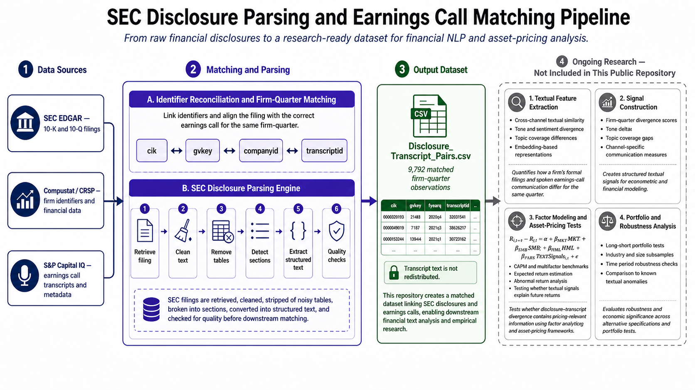

# SEC Disclosure Parsing and Earnings-Call Linkage for Financial NLP Research

A Python pipeline for parsing SEC 10-Q and 10-K filings and linking each filing to the corresponding fiscal-quarter earnings call transcript. The repository produces a structured firm-quarter dataset of disclosure-transcript pairs intended to support financial NLP, corporate disclosure research, and asset-pricing analysis.

> **Status:** Component of an ongoing research project. The parsing and matching pipeline is open here. The full empirical paper, proprietary transcript text, and downstream return-prediction analysis are not included.

---

## Executive Summary

This repository implements the data-engineering layer of a broader research project that compares two corporate communication channels: formal SEC disclosures and earnings call transcripts. It does two hard things end-to-end:

1. **Parses SEC 10-Q and 10-K filings into clean, item-level text.** EDGAR HTML is large, inconsistently formatted across filers and years, and littered with tables, table-of-contents links, and old-style markup. The pipeline downloads filings via SEC EDGAR, strips tables using four complementary heuristics (HTML hyperlinks, numeric content, inline CSS background colors, and legacy HTML color attributes), detects "Item" section headers, and extracts the body text for each section as a `{section_title: text}` dictionary.

2. **Matches each filing to the correct earnings call transcript.** Aligning a 10-Q or 10-K with the corresponding earnings call requires reconciling firm identifiers (`cik`, `gvkey`, `companyid`), fiscal calendars, filing dates, and transcript availability. The result, `data/Disclosure_Transcript_Pairs.csv`, contains 9,792 matched firm-quarter observations spanning S&P 500 constituents and includes both filing metadata (`TXTAddress`, `FormType`, `DateFiled`) and transcript metadata (`transcriptid`, `mostimportantdateutc`, `transcript_fy`).

The matched dataset is the input layer for downstream textual and asset-pricing analysis: comparing how firms communicate the same fiscal quarter through formal filings versus verbal earnings calls, and testing whether divergence between the two channels carries predictive information for future returns or risk.

---

## Research Motivation

Corporate managers communicate through multiple channels with very different formats and audiences. SEC filings are formal, lawyer-reviewed, and standardized. Earnings calls are verbal, conversational, and shaped by live questioning from analysts. The same fiscal quarter is described twice, in different registers, by the same management team.

A natural research question follows: do firms strategically frame information differently across formal and verbal disclosures, and do the differences contain information useful for forecasting performance, risk, or returns?

This project builds on the intuition of **Cohen, Malloy, and Nguyen (2020), "Lazy Prices,"** which shows that subtle textual changes in SEC disclosures predict future stock returns. The current project extends that intuition along a new dimension: rather than comparing a firm's filings across time, it compares a firm's filings against its earnings call transcripts within the same fiscal quarter. The hypothesis is that systematic differences in tone, emphasis, specificity, or topical coverage across these two channels may contain information that is not yet priced.

The downstream research goal is to plug textual signals derived from these pairs into factor models of expected returns and test whether disclosure-transcript divergence helps explain abnormal returns or supports tradable signals. Those empirical tests live in the broader, non-public part of the project; this repository builds the dataset that makes them possible.

---

## Repository Scope

**Included in this repository**

- SEC 10-Q and 10-K parsing classes (`Disclosure`, `Disclosure_10K`)
- Table-removal, item-detection, and section-extraction logic
- Firm-quarter matched pairs file (`Disclosure_Transcript_Pairs.csv`)
- An example processing script (`Disclosure_Cleaner.py`) demonstrating end-to-end use
- SEC Financial Statement Data Sets used in fiscal-quarter resolution (`src/Financial Statement Dataset/`)

**Not included (part of the broader, ongoing research project)**

- The full research paper and write-up
- Proprietary earnings call transcript text (sourced from S&P Capital IQ)
- Downstream textual-similarity, sentiment, and embedding analyses
- Factor-model estimation and return-prediction tests
- Portfolio-construction code and backtests

---

## Data Pipeline Overview

The end-to-end workflow that produced `Disclosure_Transcript_Pairs.csv` and the section-level disclosure text is:

1. **Identify candidate firm-quarters.** Combine SEC EDGAR filing metadata with Compustat (`gvkey`) and Capital IQ (`companyid`, `transcriptid`) identifiers to enumerate firm-quarters with both a 10-Q/10-K and an earnings call.
2. **Resolve fiscal calendars.** Reconcile reporting fiscal year and quarter across data sources to handle non-calendar fiscal years and late filings (`disclosure_estimated_fiscal_quarter`, `disclosure_for_the_period`, `delay`).
3. **Match disclosures to transcripts.** Pair each filing with its corresponding earnings call using firm identifiers and the fiscal quarter, with timing checks against `DateFiled` and `mostimportantdateutc`.
4. **Persist matched pairs.** Write the resulting firm-quarter panel to `data/Disclosure_Transcript_Pairs.csv` (9,792 rows).
5. **Download and parse SEC filings.** For each pair, retrieve the EDGAR `.txt` file and parse it through the `Disclosure` (10-Q) or `Disclosure_10K` (10-K) class.
6. **Clean and segment.** Strip tables, detect Item-level section headers, and extract section body text.
7. **Export structured output.** Save section-level dictionaries keyed by `transcriptid` for downstream textual analysis.

---

## Technical Methodology

The parsing pipeline is implemented in pure Python with `BeautifulSoup` and `lxml`/`html5lib` backends, plus `Levenshtein` for fuzzy header matching. The core ideas:

**Robust filing retrieval.** `Load()` fetches each filing via `requests` against `https://www.sec.gov/Archives/`, with a compliant SEC EDGAR `User-Agent`. It tries the fast `html.parser` first and falls back to `html5lib` when the document is malformed.

**Four-stage table removal.** SEC filings interleave narrative text with hundreds of numeric tables, which break naive section detection. `Remove_Tables()` runs four passes:
- `Remove_Tables_hreflinks` strips tables whose cells contain in-document anchors (typically table-of-contents tables).
- `Remove_Tables_Numerical` removes tables whose cells are predominantly numeric (financial schedules).
- `Remove_Tables_Color_css` removes tables with non-white inline CSS `background-color`.
- `Remove_Tables_Color_html` removes tables colored via legacy HTML attributes.

**Item-level section detection.** `Section_Finder_html()` scans the cleaned HTML for candidate "Item N." headers. `Item_Matcher()` and `Final_Item_Checker()` validate candidates against curated dictionaries of canonical 10-Q and 10-K items (`Official_Items`, `Official_Items_10K`) and their important-word fingerprints (`Official_Items_important_words`, `Official_Items_important_words_10K`), using Levenshtein distance to absorb spelling and formatting variants observed in the wild ("Item 2. Properties." vs. "Item 2. Property." vs. "Item 2. Description of Properties.").

**Section text extraction.** `Section_text_Finder()` walks the HTML between consecutive validated headers and assembles the body text, with `Clean_Element_Texts()` normalizing whitespace and stray markup.

**Old-filing handling.** `Is_This_Old_html()` flags pre-modern HTML filings whose structure does not lend itself to header-based parsing, so they can be quarantined rather than silently producing bad output.

**Fiscal-quarter alignment.** Firm-quarter matching uses Compustat (`gvkey`, `datafqtr`) and Capital IQ identifiers in addition to `cik`, plus filing-date vs. earnings-call-date comparisons (`delay`, `absolute_delay`) to verify that a given disclosure and transcript actually describe the same quarter.

**Validation hooks.** Each `Disclosure` instance exposes `debug` and `print_removed_tables` flags, a `corrupted` indicator, and a `State` attribute, so problematic filings (old HTMLs, parse failures, missing strings) are logged rather than aborting the run.

---

## Financial and Research Applications

The matched dataset is designed to support a range of downstream financial NLP and asset-pricing analyses:

- **Cross-channel textual comparison.** Compare language in 10-Q/10-K Item sections to language in the corresponding earnings call transcript for the same firm-quarter.
- **Disclosure-divergence measurement.** Construct similarity, divergence, and topic-coverage measures between formal filings and verbal disclosures.
- **Managerial communication research.** Study whether managers selectively emphasize information across channels, and whether that varies with firm performance, risk, or governance characteristics.
- **Asset-pricing tests.** Use textual signals as inputs to factor models (CAPM, Fama-French, q-factor) to estimate expected returns and examine whether disclosure-transcript divergence helps explain abnormal returns.
- **Event-study infrastructure.** The panel includes filing dates and earnings-call dates, supporting event windows around either event.
- **Investment-signal research.** Provide a foundation for building textual signals that can be evaluated as candidate alpha factors or risk indicators.
- **Risk and earnings-quality monitoring.** Persistent divergence between formal filings and verbal communication is itself a candidate risk signal worth examining.

This repository does not claim profitable trading performance. It builds the dataset and infrastructure on which such tests can be run.

---

## Key Challenges

The work that produced this repository is harder than it looks at first glance:

- **EDGAR HTML is not standardized.** Layout, table styling, and section header conventions vary across filers, years, and law firms. A naive parser produces silently wrong output. The four-stage table remover and the fuzzy item-matcher exist because every shortcut tried earlier failed on a non-trivial slice of filings.
- **Item headers are noisy.** Filings include phrases like "Item 4. REMOVED AND RESERVED.", inconsistent punctuation and capitalization, alternate titles for the same item, and stray re-mentions of item names inside body text. Robust detection requires both a curated item catalogue and a fuzzy matching layer.
- **Fiscal-quarter alignment across data sources is non-trivial.** Compustat fiscal calendars, Capital IQ transcript dates, and SEC filing dates do not line up cleanly. Matching requires reconciling `gvkey`, `cik`, `companyid`, `transcriptid`, `fiscal_year`, `fiscal_quarter`, `disclosure_for_the_period`, and `mostimportantdateutc`, and validating with filing-vs-call delay measures.
- **Filing timing and availability.** Some filings are amended, late, or filed under different form types within a quarter. Some firm-quarters have no transcript. The matched panel reflects only the firm-quarters where a clean pairing exists.
- **Scale.** Even at 9,792 firm-quarter observations, downloading and parsing every filing requires careful rate-limiting against EDGAR, fault tolerance per filing, and per-document logging.

The combination of financial domain knowledge, regulatory-filing structure, and text-engineering judgment is the actual contribution of the work.

---

## Example Output

`data/Disclosure_Transcript_Pairs.csv` contains one row per matched firm-quarter. A representative subset of columns:

| Column | Meaning |
|---|---|
| `cik` | SEC Central Index Key |
| `gvkey` | Compustat firm identifier |
| `companyid`, `transcriptid` | Capital IQ company and transcript identifiers |
| `CompanyName`, `companyname` | Filer name (SEC and Capital IQ) |
| `FormType` | `10-Q` or `10-K` |
| `DateFiled` | SEC filing date |
| `TXTAddress`, `DisclosureAddress` | EDGAR `.txt` and index URLs |
| `fiscal_year`, `fiscal_quarter` | Fiscal calendar (Compustat) |
| `transcript_fy`, `meeting_year` | Transcript-side fiscal calendar |
| `mostimportantdateutc` | Earnings call date |
| `delay`, `absolute_delay` | Days between filing and earnings call |
| `marketCap`, `tobinsQ` | Firm-quarter market characteristics |
| `sp500_constituent` | S&P 500 membership flag |

A typical row links Oracle Corporation (`cik` 1341439, `gvkey` 12142) for fiscal Q1 2011 to its 10-Q filed 2010-09-20 and to Capital IQ `transcriptid` 78205 for the corresponding earnings call. Per-filing parsed section text is produced on demand by running the parser over each row's `TXTAddress`.

The CSV does not include earnings call transcript text. Transcripts are sourced from S&P Capital IQ under license and are not redistributed in this repository.

---

## Skills Demonstrated

This project demonstrates practical capabilities relevant to quantitative finance, investment research, and financial data engineering:

- Financial data engineering at the intersection of SEC EDGAR, Compustat, and Capital IQ
- SEC filing analysis and Item-level section parsing for 10-Q and 10-K forms
- Financial NLP infrastructure: text cleaning, normalization, and structuring of unstructured filings
- Regular-expression and HTML parsing of large, inconsistently formatted regulatory documents
- Fuzzy matching with Levenshtein distance to handle real-world header variation
- Firm-quarter panel construction and identifier reconciliation across data vendors
- Python software engineering: object-oriented design (`Disclosure`, `Disclosure_10K`), defensive error handling, debug instrumentation
- Data validation and quality checks on a 9,792-row firm-quarter panel
- Preparation of structured datasets ready for econometric and asset-pricing modelling
- Translating unstructured financial text into structured research-grade datasets

---

## Limitations and Ongoing Work

This repository is the data-construction component of an ongoing research project. Empirical results are not included here and are not yet finalized. Planned and in-progress extensions include:

- Textual similarity, divergence, and overlap measures between filings and transcripts
- Tone and sentiment comparison across the two channels
- Topic modelling and embedding-based representations of disclosure-transcript pairs
- Linking textual signals to expected returns within factor-model frameworks (CAPM, Fama-French, q-factor)
- Tests of whether disclosure-transcript divergence is associated with abnormal returns
- Robustness checks across industries, firm sizes, and time periods
- Portfolio-sort and long-short tests to evaluate signal economic significance

These extensions should be read as forward-looking research directions, not completed results.

---

## Citation and Academic Context

This project is inspired by and extends the textual-disclosure asset-pricing literature, in particular:

> Cohen, L., Malloy, C., & Nguyen, Q. (2020). **Lazy Prices.** *Journal of Finance*, 75(3), 1371-1415.

"Lazy Prices" shows that subtle changes in the text of SEC filings between consecutive periods predict future returns. The present project extends that intuition along a different dimension: it compares a firm's formal SEC disclosures to its earnings call transcripts within the same fiscal quarter, asking whether differences across these two communication channels carry similar predictive content. The current repository implements the data-construction step required for that comparison; the empirical paper is in progress.

---

x
